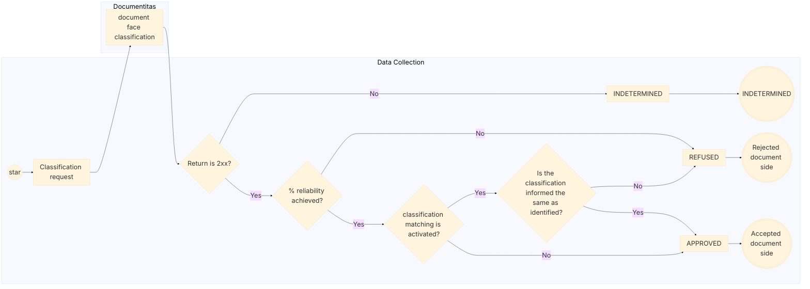

# teste

```mermaid
%%{init: {'theme': 'base', 'themeVariables': { 'fontSize': '30px', 'fontFamily': 'Inter'}}}%%
flowchart LR
    subgraph Data Collection
        j1((star))-->j2[Classification request]
        j3{Return is 2xx?}
        j3-------->|No| j5[INDETERMINED] ---> j6(((INDETERMINED)))
        j3--->|Yes| j7{% reliability achieved?}
        j7--->|No| j8[REFUSED] --> j9(((Rejected document side)))
        j7--->|Yes| j10{classification matching is activated?}
        j10--->|Yes| j11{Is the classification informed the same as identified?}
        j10--->|No| j12
        j11--->|No| j8
        j11--->|Yes| j12[APPROVED]
        -->j13(((Accepted document side)))
    end

    subgraph Documentitas
    j2 --> d2[document face classification]
    d2-->j3
    end
```
