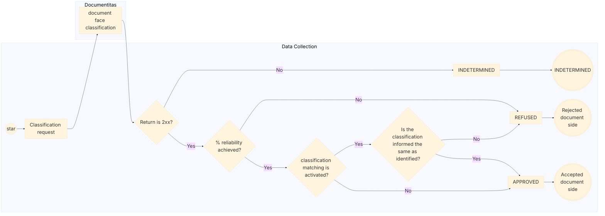
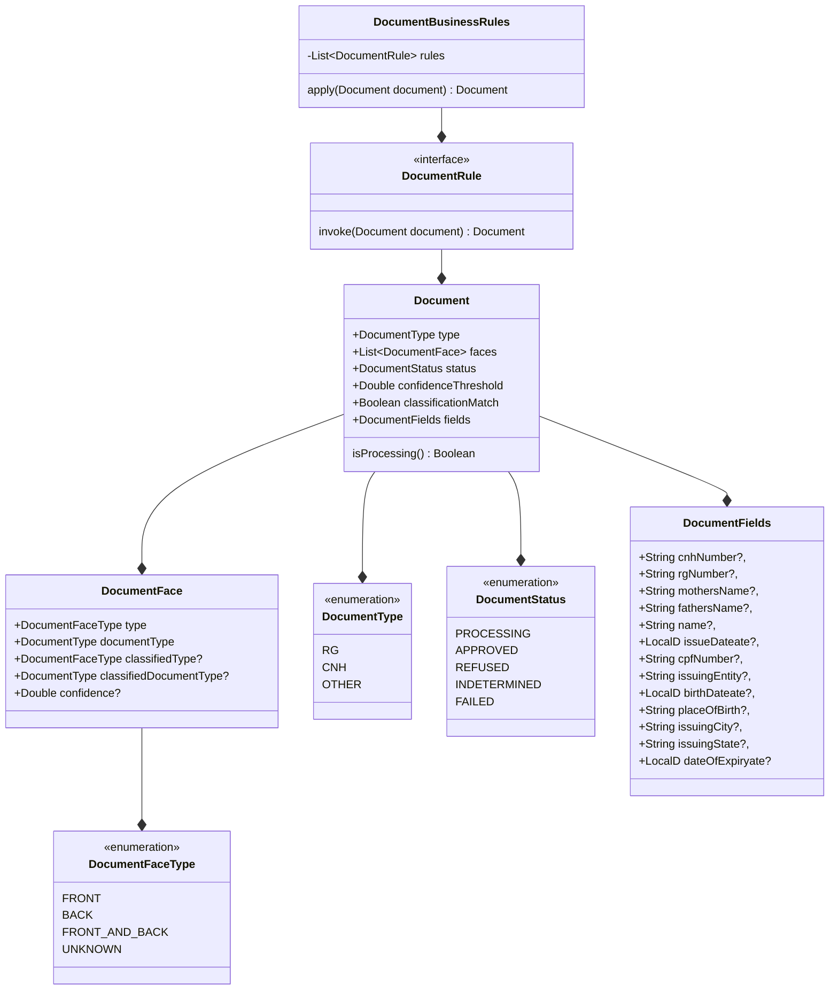
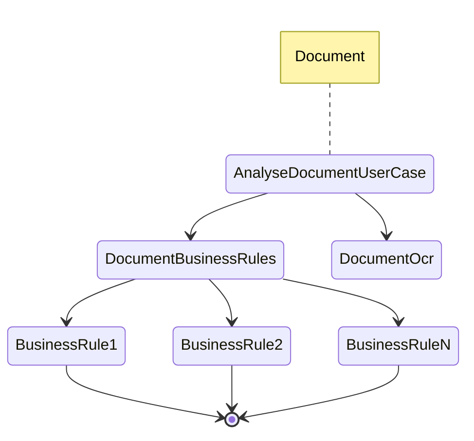

# teste

```mermaid
%%{init: {'theme': 'base', 'themeVariables': { 'fontSize': '30px', 'fontFamily': 'Inter'}}}%%
flowchart LR
    subgraph Data Collection
        j1((star))-->j2[Classification request]
        j3{Return is 2xx?}
        j3-------->|No| j5[INDETERMINED] ---> j6(((INDETERMINED)))
        j3--->|Yes| j7{% reliability achieved?}
        j7--->|No| j8[REFUSED] --> j9(((Rejected document side)))
        j7--->|Yes| j10{classification matching is activated?}
        j10--->|Yes| j11{Is the classification informed the same as identified?}
        j10--->|No| j12
        j11--->|No| j8
        j11--->|Yes| j12[APPROVED]
        -->j13(((Accepted document side)))
    end

    subgraph Documentitas
    j2 --> d2[document face classification]
    d2-->j3
    end
```

```mermaid
classDiagram
    class DocumentBusinessRules {
        -List~DocumentRule~ rules
        apply(Document document) Document
    }
    
    class DocumentRule {
        <<interface>>
        invoke(Document document) Document
    }
    
    class Document {
        +DocumentType type
        +List~DocumentFace~ faces
        +DocumentStatus status
        +Double confidenceThreshold
        +Boolean classificationMatch
        +DocumentFields fields
        isProcessing() Boolean
    }
    
    class DocumentFace {
        +DocumentFaceType type
        +DocumentType documentType
        +DocumentFaceType classifiedType?
        +DocumentType classifiedDocumentType?
        +Double confidence?
    }
    
    class DocumentType {
        <<enumeration>>
        RG
        CNH
        OTHER
    }
    
    class DocumentFaceType {
        <<enumeration>>
        FRONT
        BACK
        FRONT_AND_BACK
        UNKNOWN
    }
    
    class DocumentStatus {
        <<enumeration>>
        PROCESSING
        APPROVED
        REFUSED
        INDETERMINED
        FAILED
    }
    
    class DocumentFields {
        +String cnhNumber?,
        +String rgNumber?,
        +String mothersName?,
        +String fathersName?,
        +String name?,
        +LocalD issueDateate?,
        +String cpfNumber?,
        +String issuingEntity?,
        +LocalD birthDateate?,
        +String placeOfBirth?,
        +String issuingCity?,
        +String issuingState?,
        +LocalD dateOfExpiryate?
    }
    
    DocumentBusinessRules --* DocumentRule
    DocumentRule --* Document
    Document --* DocumentType
    Document --* DocumentFace
    Document --* DocumentStatus
    Document --* DocumentFields
    DocumentFace --* DocumentFaceType    
```

```mermaid
stateDiagram-v2
    AnalyseDocumentUserCase --> DocumentBusinessRules
    AnalyseDocumentUserCase --> DocumentOcr
    note left of AnalyseDocumentUserCase : Document
    DocumentBusinessRules --> BusinessRule1
    DocumentBusinessRules --> BusinessRule2
    DocumentBusinessRules --> BusinessRuleN
    BusinessRule1 --> [*]
    BusinessRule2 --> [*]
    BusinessRuleN --> [*]
```
