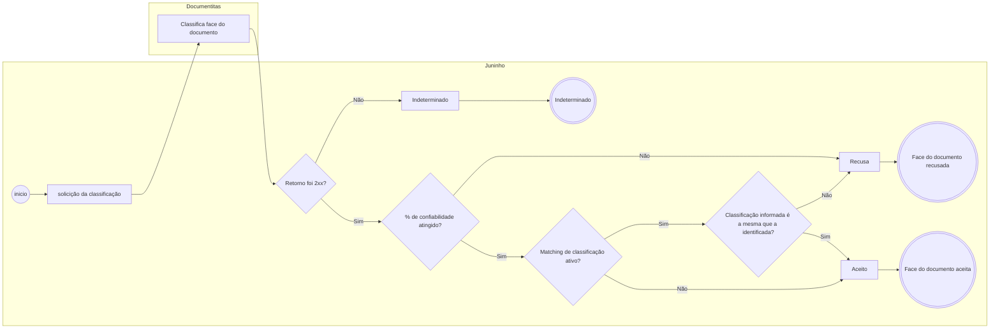

# teste

```mermaid
flowchart LR
    subgraph Juninho
        j1((inicio))-->j2[solicição da classificação]
        j3{Retorno foi 2xx?}
        j3--->|Não| j5[Indeterminado] ---> j6(((Indeterminado)))
        j3--->|Sim| j7{% de confiabilidade atingido?}
        j7-->|Não| j8[Recusa] --> j9(((Face do documento recusada)))
        j7--->|Sim| j10{Matching de classificação ativo?}
        j10---->|Sim| j11{Classificação informada é a mesma que a identificada?}
        j10-->|Não| j12
        j11-->|Não| j8
        j11-->|Sim| j12[Aceito]
        j12-->j13(((Face do documento aceita)))
    end

    subgraph Documentitas
    j2 --> d2[Classifica face do documento]
    d2-->j3
    end
```
